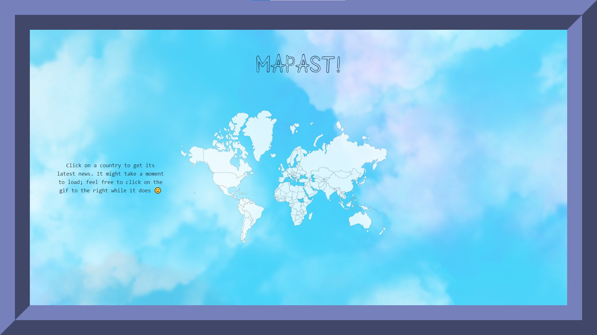

# PERSCHOLAS 2023 MOD 2 FINAL

## Description
MAPAST! is a simple global news page where you can click anywhere on the map and get the latest globally available news from that region. Interact with both the map and the gif to get results.

## Code
- HTML
- CSS
- REACTjs + JSX + JSON

## Resources
Long live the open source culture!
- Used GIPHY API
- Used Currents API

##
so the final product changed from the wireframe but here it is anyway:

## Details

PERSCHOLAS 2023 WOMEN IN SOFTWARE ENGINEERING (WiSE) MODULE 1 FINAL PROJECT DUE 11/6/'23
